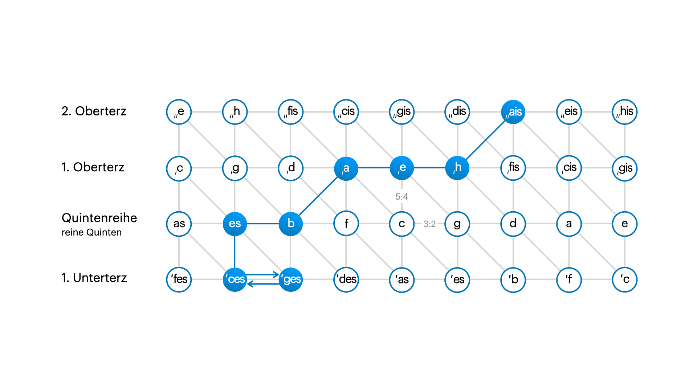

# Seminar Intonation – Wintersemester 2025 (HMDK)

|                 |                                                 |
| --------------- | ----------------------------------------------- |
| **Autor**       | Albert Mañosa Sardà                             |
| **Dozent**      | Prof. Michael Flade                             |
| **Kurs**        | Seminar Intonation – WS25                       |
| **Universität** | [HMDK Stuttgart](https://www.hmdk-stuttgart.de) |
| **Datum**       | 5. Februar 2026                                 |

---

Dieses Projekt beschäftigt sich mit der Intonation eines vierstimmigen, stark modulierenden Akkordabschnitts. Als musikalisches Beispiel dient der letzte Modulationsversuch aus Max Regers _Beiträge zur Modulationslehre_, Nr. 100: Ces-dur (ces-moll). In diesem Beispiel zeigt Reger einen extremen Modulationsprozess, der von ais-moll nach Ces-dur führt und damit einen sehr großen Quintabstand überbrückt (17 Quinten).

> ### [Ces-dur (ces-moll)](<docs/Beiträge zur Modulationslehre - 100 Ces-dur (ces-moll).pdf>)
>
> 
>
> 1. Tonika ais-moll;
> 2. Akkord der neapolitanischen Sexte (dis fis h) von ais-moll; Umdeutung dieses Sextakkordes (dis fis h) zur 1. Versetzung der Oberdominante (H-dur) von E-dur;
> 3. Tonika E-dur; Umdeutung dieses E-dur zur Oberdominante in a-moll;
> 4. Tonika a-moll;
> 5. Akkord der neapolitanischen Sexte (d f b) von a-moll; Umdeutung dieses Sext-akkordes (d f b) zur 1. Versetzung der Tonika B-dur (in B-dur);
> 6. Unterdominante (Es-dur) von B-dur;
> 7. Akkord der neapolitanischen Sexte (es ges ces) von B-dur; Umdeutung dieses Sextakkordes (es ges ces) zur 1. Versetzung der Tonika Ces-dur (in Ces-dur);
> 8. Oberdominante Ges-dur;
> 9. Tonika Ces-dur (ces-moll).
>
> 

## Tonnetz

Die Tonnetz kann uns helfen, diesen Modulationsprozess grafisch darzustellen. Auf der Tonnetz-Karte lassen sich die Beziehungen zwischen den Akkorden und Tonarten leicht erkennen, sodass die Bewegung durch den Quintenzirkel und die Verwendung der neapolitanischen Sextenakkorde anschaulich sichtbar wird.

Hier geht es um eine Modulation von cis-Moll (+10) nach ces-Dur (-7), also insgesamt 17 absteigende Quinten. Max Reger wählt diese sehr entfernten Tonarten bewusst, um Enharmonien zu vermeiden. Obwohl er anderthalb Runden im Quintenzirkel zurücklegt, bleibt der Prozess zentriert genug, um klar hörbar zu sein.

Zudem gelingt es Reger, die Modulation mit nur 9 Akkorden zusammenzufassen, inklusive der Ankunft in der neuen Tonart.

Die Modulation nutzt die Schnelligkeit, mit der neapolitanische Sextenakkorde im Quintenzirkel bewegt werden können. In diesem Beispiel setzt Reger von den 9 Akkorden der Modulation drei neapolitanische Sextenakkorde ein: ais → h (-5 Quinten), a → b (-5 Quinten), es → ces (-4 Quinten). Diese Akkorde übernehmen somit 14 der insgesamt 17 absteigenden Quinten.

Ziel dieser Arbeit ist es, fünf verschiedene Intonationsmöglichkeiten für denselben harmonischen Verlauf zu vergleichen:

1. gleichstufig temperiert,
2. pythagoreisch,
3. rein,
4. rein mit zwei Bezugspunkten,
5. mitteltönig.
6. (Supplement) rein mit temperierter Sopranstimme.
