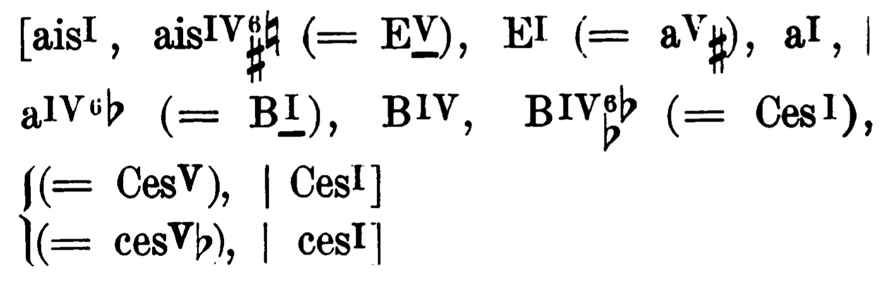
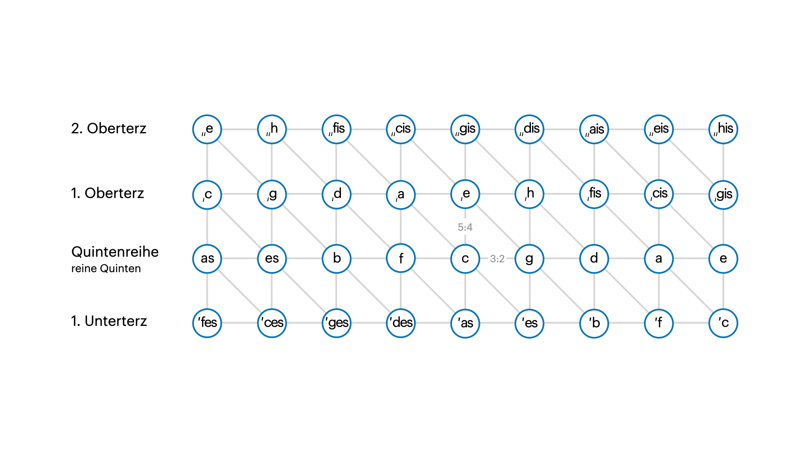
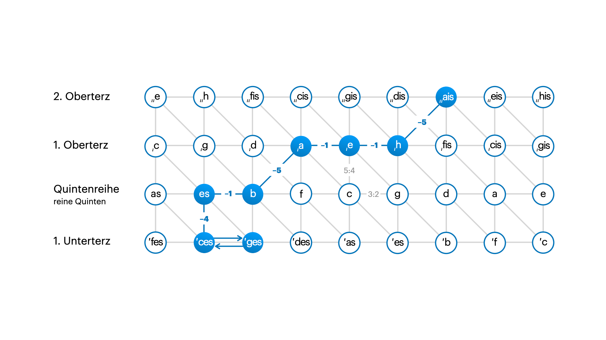
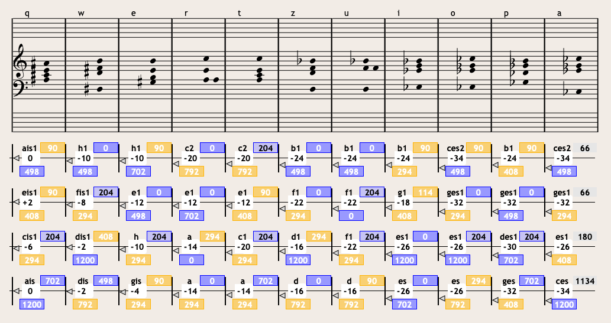
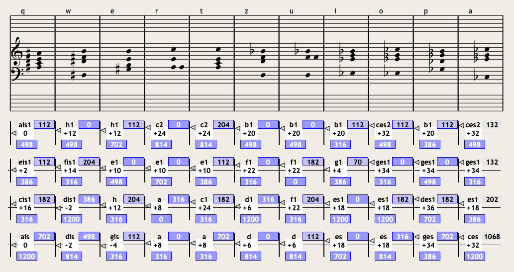
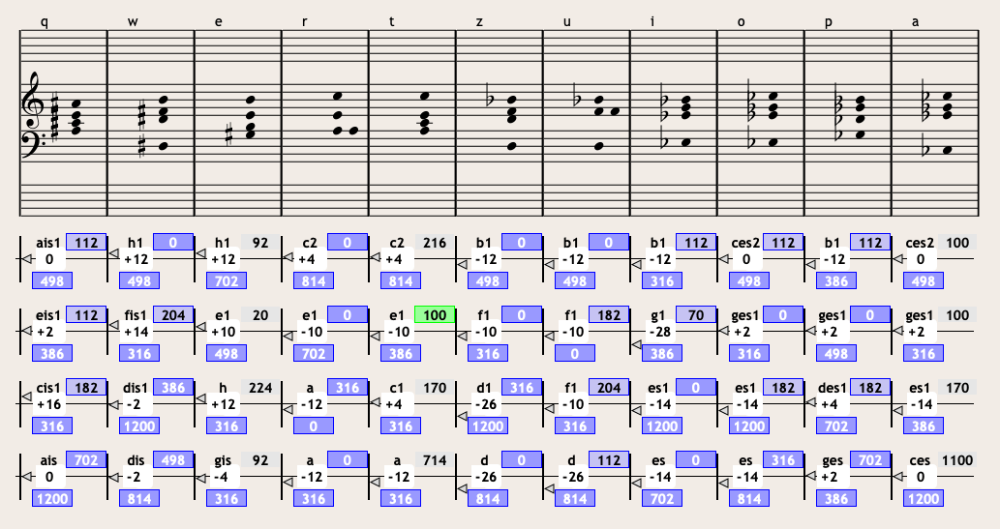
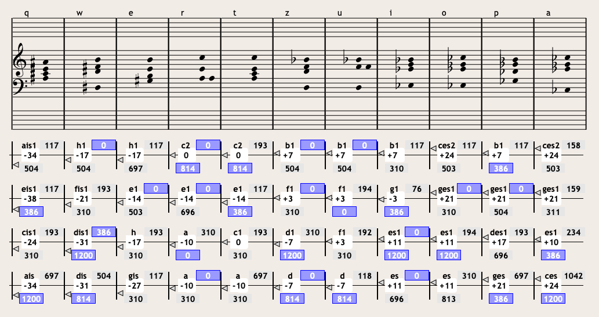
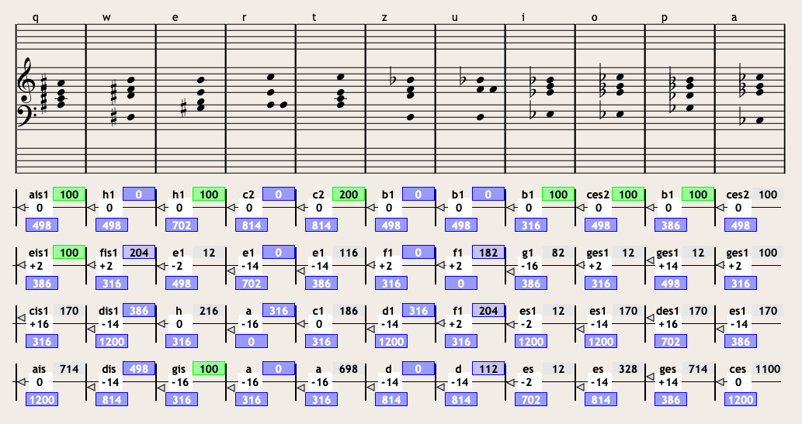
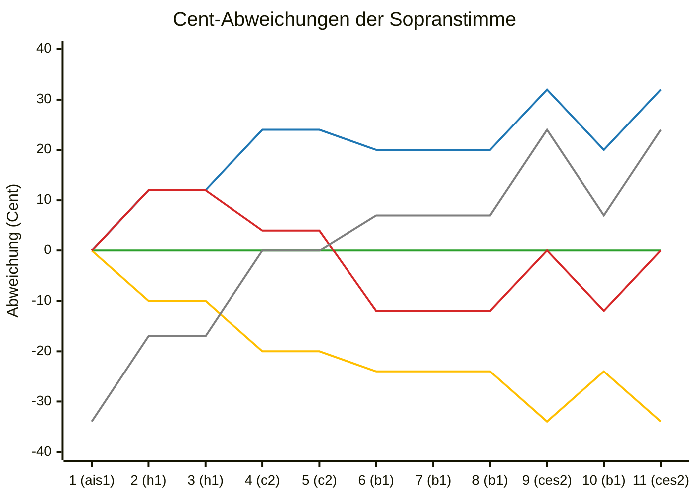

# Seminar Intonation – Wintersemester 2025 (HMDK)

|                 |                                                 |
| --------------- | ----------------------------------------------- |
| **Autor**       | Albert Mañosa Sardà                             |
| **Dozent**      | Prof. Michael Flade                             |
| **Kurs**        | Seminar Intonation – WS25                       |
| **Universität** | [HMDK Stuttgart](https://www.hmdk-stuttgart.de) |
| **Datum**       | 5. Februar 2026                                 |

---

Diese Arbeit analysiert und vergleicht fünf verschiedene Intonationssysteme anhand desselben harmonischen Verlaufs. Ziel ist es, sowohl die klanglichen Eigenschaften der einzelnen Systeme als auch ihre Auswirkungen auf die Wahrnehmung eines extremen Modulationsprozesses zu beschreiben und zu bewerten.

## Musikalisches Ausgangsbeispiel

Untersucht wird ein vierstimmiger, stark modulierender Akkordabschnitt aus Max Regers [_Beiträge zur Modulationslehre_, Nr. 100: **Ces-Dur (ces-Moll)**](<docs/Beiträge zur Modulationslehre - 100 Ces-dur (ces-moll).pdf>). Der letzte Modulationsversuch dieses Beispiels führt von **ais-Moll** nach **Ces-Dur** und überbrückt damit einen sehr großen Abstand von **17 Quinten**.

Diese extreme Distanz macht den Abschnitt besonders interessant für den Vergleich verschiedener Intonationssysteme, da sich ihre charakteristischen Intervalle und Akkordverhältnisse hier klar akustisch nachvollziehen lassen.

### Harmonischer Ablauf

> 1. Tonika ais-moll;
> 2. Akkord der neapolitanischen Sexte (dis fis h) von ais-moll; Umdeutung dieses Sextakkordes (dis fis h) zur 1. Versetzung der Oberdominante (H-dur) von E-dur;
> 3. Tonika E-dur; Umdeutung dieses E-dur zur Oberdominante in a-moll;
> 4. Tonika a-moll;
> 5. Akkord der neapolitanischen Sexte (d f b) von a-moll; Umdeutung dieses Sext-akkordes (d f b) zur 1. Versetzung der Tonika B-dur (in B-dur);
> 6. Unterdominante (Es-dur) von B-dur;
> 7. Akkord der neapolitanischen Sexte (es ges ces) von B-dur; Umdeutung dieses Sextakkordes (es ges ces) zur 1. Versetzung der Tonika Ces-dur (in Ces-dur);
> 8. Oberdominante Ges-dur;
> 9. Tonika Ces-dur (ces-moll).
>
> 

## Darstellung im Tonnetz

Zur Visualisierung des Modulationsprozesses wird das **Eulersche Tonnetz** verwendet. Es ermöglicht eine anschauliche Darstellung der Beziehungen zwischen Akkorden und Tonarten und zeigt insbesondere die Bewegung entlang des Quintenzirkels.

Die Modulation führt von **ais-Moll** (das 10 Quinten über c liegt) nach **Ces-Dur** (das 7 Quinten unter c liegt), was insgesamt **17 absteigenden Quinten** entspricht. Reger wählt diese sehr entfernten Tonarten bewusst, um Tonarten mit Doppelkreuz- oder Doppel-Bemoll-Tönen zu vermeiden. Trotz der Länge des Weges bleibt der Prozess gut nachvollziehbar.

Ein zentrales Mittel, das für viele Modulationen bei Reger charakteristisch ist, sind die **neapolitanischen Sextakkorde**, die eine schnelle Bewegung im Quintenzirkel erlauben. Von den neun Akkorden der Modulation sind drei neapolitanische Sexten:

- ais → h (−5 Quinten)
- a → b (−5 Quinten)
- es → ces (−4 Quinten)

Damit übernehmen diese drei Akkorde **14 der insgesamt 17 absteigenden Quinten**.

## Vergleich der Intonationsmöglichkeiten

Im Folgenden werden fünf verschiedene Intonationssysteme für denselben harmonischen Verlauf verglichen. Jede Version wird im Hinblick auf ihre Vor- und Nachteile diskutiert.

### 1. Pythagoreische Stimmung

<video controls src="presets/preset-2.mp4" title="Pythagoreische Stimmung"></video>

Die pythagoreische Stimmung basiert auf reinen Quinten (702c). Dadurch werden melodische und modulatorische Zusammenhänge deutlich hörbar.

Die Modulation wirkt klar und flüssig. Dur-Akkorde besitzen jedoch eine erhöhte Spannung, da die große Terz deutlich größer ist (408c) als in anderen Systemen.

Durch die kontinuierliche Bewegung in absteigenden Quinten entsteht eine starke kumulative Abweichung. Am Ende liegt die Sopranstimme bei etwa **−34c** gegenüber der temperierten Stimmung.

**Vorteile:**

- Sehr klare Darstellung von Quintbeziehungen
- Modulation strukturell gut nachvollziehbar

**Nachteile:**

- Starke Tonhöhenverschiebung über längere Verläufe
- Spannungsreiche, teilweise harte Dur-Akkorde

### 2. Reine Stimmung

<video controls src="presets/preset-3.mp4" title="Reine Stimmung"></video>

In der reinen Stimmung werden alle Akkorde intern möglichst konsonant gestimmt, insbesondere mit reinen großen Terzen (386c).

Jeder einzelne Akkord klingt sehr ausgeglichen und stabil. Die Modulation selbst wirkt jedoch rauer und schwerer verständlich, da abrupte enharmonische Wechsel auftreten.

Durch die lineare Bewegung der Stimmen steigt die Tonhöhe im Verlauf stark an. Die Sopranstimme erreicht am Ende etwa **+32c**.

**Vorteile:**

- Maximale Konsonanz innerhalb der einzelnen Akkorde
- Sehr ruhiger, „reiner“ Klang

**Nachteile:**

- Schlechte Nachvollziehbarkeit der Modulation
- Große globale Abweichung der Tonhöhe

### 3. Reine Stimmung mit zwei Bezugspunkten

<video controls src="presets/preset-4.mp4" title="Reine Stimmung mit zwei Bezugspunkten"></video>

Diese Variante basiert ebenfalls auf reiner Stimmung, verwendet jedoch zwei feste Bezugspunkte, um die Gesamtabweichung zu begrenzen.

Die Beziehungen zwischen benachbarten Akkorden wirken angenehmer als in der vollständig reinen Version. Die Progression endet bewusst bei **±0c**.

Die notwendigen Korrekturen erfolgen an Stellen mit großen chromatischen Sprüngen, an denen eine reine Beziehung ohnehin kaum wahrnehmbar ist.

Obwohl die extreme Endabweichung vermieden wird, bleibt die Modulation als Ganzes weiterhin schwer verständlich.

**Vorteile:**

- Begrenzung der globalen Tonhöhenverschiebung
- Lokal gute Akkordkonsonanz

**Nachteile:**

- Brüche in der Stimmführung
- Modulatorische Logik weiterhin wenig klar

### 4. Mitteltönige Stimmung

<video controls src="presets/preset-5.mp4" title="Mitteltönige Stimmung"></video>

Die mitteltönige Stimmung stellt einen Kompromiss zwischen reinen Terzen (386c) und kontrollierbaren Quintabweichungen dar. Konkret basiert sie auf der **¼-Komma-Mitteltönung**, wobei die Quinte bei **696,5c** liegt, die im Vergleich zur reinen Stimmung um **−5,5c** verschoben ist.

Es entsteht ein leicht schwebender, lebendiger Klang, der als angenehm empfunden wird, ohne deutlich verstimmt zu wirken.

Diese Version bietet ein ausgewogenes Verhältnis zwischen Akkordkonsonanz und modulatorischer Verständlichkeit.

**Vorteile:**

- Gute Balance zwischen Reinheit und Flexibilität
- Modulation bleibt hörbar nachvollziehbar

**Nachteile:**

- Die Quintreine Brillanz geht dabei verloren
- Leichte Schwebungen bleiben hörbar

### 5. Reine Stimmung mit temperierter Sopranstimme (Supplement)

<video controls src="presets/preset-6.mp4" title="Reine Stimmung mit temperierter Sopranstimme"></video>

In dieser Variante bleibt die Sopranstimme gleichstufig temperiert, während die übrigen Stimmen die Akkorde jeweils rein intonieren.

Die chromatische Linie der Sopranstimme bleibt stabil, die Akkorde sind einzeln konsonant. Die Beziehungen zwischen den Akkorden wirken jedoch unvorhersehbar.

Diese Lösung kompensiert zwar die Cent-Abweichung, verschärft aber die Probleme der harmonischen Kohärenz.

**Vorteile:**

- Stabile melodische Linie
- Reine Akkorde im Momentklang

**Nachteile:**

- Inkonsistente Akkordbeziehungen
- Modulation wirkt fragmentiert

## Ideale Lösung – Zusammenfassende Bewertung

Die **¼-Komma-mitteltönige Stimmung** erscheint als die ausgewogenste Lösung. Sie ermöglicht eine klare Wahrnehmung der Modulation, bewahrt die klangliche Qualität der Akkorde und vermeidet gleichzeitig extreme Tonhöhenabweichungen, wodurch die Vorteile der verschiedenen Intonationssysteme nachvollziehbar werden.

Die anderen Varianten zeigen jeweils spezifische Stärken, machen jedoch deutlich, dass extreme Modulationsprozesse immer einen Kompromiss zwischen lokaler Konsonanz und globaler Stimmungsstabilität erfordern.

## Anhang: Abweichungsanalyse

Die grafische Analyse der Cent-Abweichungen der Sopranstimme verdeutlicht die langfristigen Effekte der einzelnen Intonationssysteme und unterstützt die oben beschriebenen Beobachtungen qualitativ.

Presets:

1. `#2ca02c` (Grün): Temperiert
2. `#ffbf00` (Gelb): Pythagoreisch
3. `#1f77b4` (Blau): Rein
4. `#d62728` (Rot): Rein mit zwei Bezugspunkte
5. `#7f7f7f` (Grau): Mitteltönig
